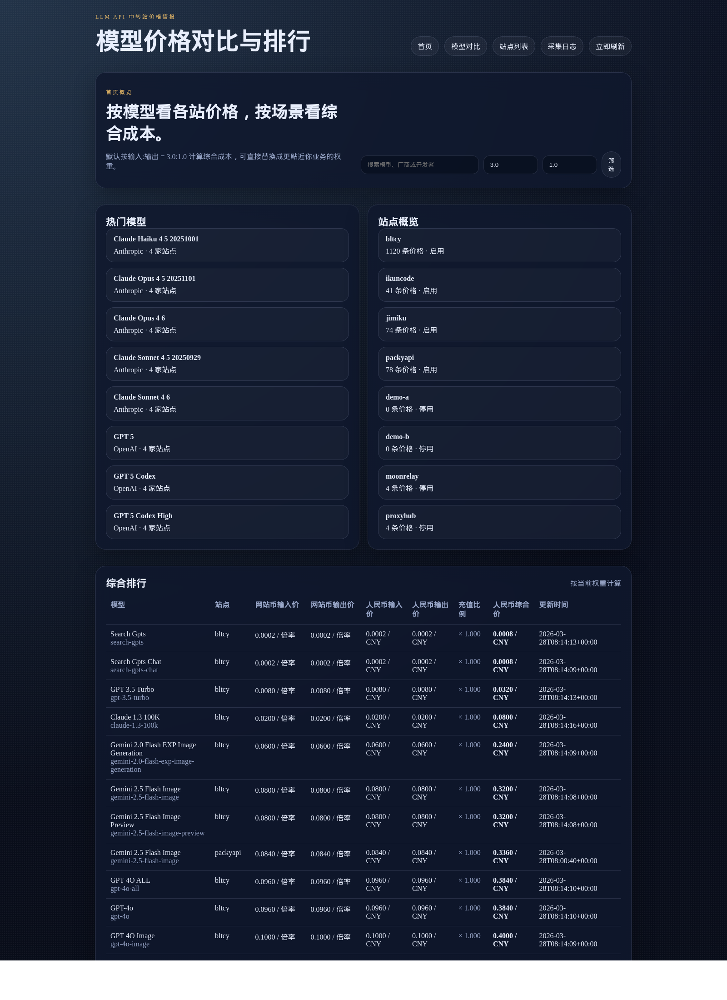

# LLM API 中转站价格对比网站



这是一个基于 Python 的轻量级价格对比网站，适合部署在无图形界面的 Linux 服务器上。

## 特性

- SQLite3 单库存储
- 进程内简单调度
- 模型价格对比与排行
- 站点详情与采集日志
- 可替换的采集适配器

## 启动

```bash
python run.py
```

然后访问 `http://127.0.0.1:8000`

## 说明

当前内置的是演示数据和可扩展的采集框架。后续可以把每个中转站的真实采集逻辑接到适配器里。

默认采集间隔为 1 小时，可通过 `APP_SCRAPE_INTERVAL` 覆盖。
